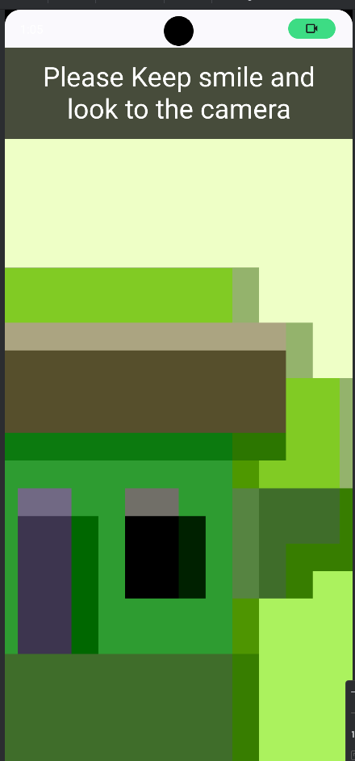

# Registration sdk task

## Overview
RegisterTask is an Android project built with Jetpack Compose that includes a feature module (`registration_sdk`) to handle registration-related tasks. The project follows modern Android development practices and employs Hilt for dependency injection, Accompanist for permissions handling, and Compose for UI development.

---


  


## Features
- Modular Architecture: A feature module (`registration_sdk`) for registration-related tasks.
- Jetpack Compose: Modern declarative UI framework.
- Hilt: Dependency injection framework for seamless integration.
- Permissions Handling: Accompanist library to manage runtime permissions.
- CameraX Integration: Allows camera functionality within the app.

  
- **App Home**:
  - App Home
    - 
  - **SDK**
    - Ask for Camera Permissions
      - 
    - Register form
      - 
    - camera for smile detactor
      - 
  
- **Clean Architecture**:
  - Implements the MVVM design pattern for scalability and maintainability.

## Requirements
- **Android Studio**: Version 4.0 or later.
- **Java Development Kit (JDK)**: Version 8 or later.
- **Kotlin**: Required for development.
- **API Level**: Supports Android 8.0 (API 26) and above.

## used libs :
  - [google mlkit face-detection](https://developers.google.com/ml-kit/vision/face-detection)
  - [Hilt](https://developer.android.com/training/dependency-injection/hilt-android) for di
  - [Coil](https://coil-kt.github.io/coil/)  for images loading
  - [Room](https://developer.android.com/training/data-storage/room) for local db
  - [retrofit](https://square.github.io/retrofit/) for networking  
  - coroutines 
  - navigation component
  - CameraX Integration: Allows camera functionality within the app.
  - Jetpack Compose: Modern declarative UI framework.
  - Permissions Handling: Accompanist library to manage runtime permissions.
  
## Try app 
  [drive link ](https://drive.google.com/file/d/10f9qYZXDlKLA0uzG6EAwSqCqThw9B708/view?usp=sharing)
    

### Installation
1. Clone the repository:
   ```bash
   git clone https://github.com/alihrhera/RegistrationSDKTask.git
   ```
2. Open the project in Android Studio.
3. Sync the Gradle files.

---

---

## Project Structure
```plaintext
RegisterTask/
├── app/                  # Base application module
├── registration_sdk/     # Feature module for registration tasks
├── build.gradle          # Root Gradle configuration
└── settings.gradle       # Module linking and Gradle settings
```

---


## Architecture
The app follows the **MVVM (Model-View-ViewModel)** design pattern with:
- Hilt for Dependency Injection.
- Navigation Component for managing screen transitions.


## Contributing
1. Fork the repository.
2. Create a new branch for your feature (`git checkout -b feature-name`).
3. Commit your changes (`git commit -m 'Add feature-name'`).
4. Push to the branch (`git push origin feature-name`).
5. Open a pull request.

---

## License
This project is licensed under the MIT License - see the [LICENSE](LICENSE) file for details.
 

